Mini Data-Analysis Deliverable 1
================

# Welcome to your (maybe) first-ever data analysis project!

And hopefully the first of many. Let’s get started:

1.  Install the [`datateachr`](https://github.com/UBC-MDS/datateachr)
    package by typing the following into your **R terminal**:

<!-- -->

    install.packages("devtools")
    devtools::install_github("UBC-MDS/datateachr")

2.  Load the packages below.

``` r
library(datateachr)
library(tidyverse)
```

    ## ── Attaching packages ─────────────────────────────────────── tidyverse 1.3.2 ──
    ## ✔ ggplot2 3.3.6      ✔ purrr   0.3.4 
    ## ✔ tibble  3.1.8      ✔ dplyr   1.0.10
    ## ✔ tidyr   1.2.1      ✔ stringr 1.4.1 
    ## ✔ readr   2.1.3      ✔ forcats 0.5.2 
    ## ── Conflicts ────────────────────────────────────────── tidyverse_conflicts() ──
    ## ✖ dplyr::filter() masks stats::filter()
    ## ✖ dplyr::lag()    masks stats::lag()

``` r
library(ggsci)
```

3.  Make a repository in the <https://github.com/stat545ubc-2022>
    Organization. You will be working with this repository for the
    entire data analysis project. You can either make it public, or make
    it private and add the TA’s and Lucy as collaborators.

# Instructions

## For Both Milestones

-   Each milestone is worth 45 points. The number of points allocated to
    each task will be annotated within each deliverable. Tasks that are
    more challenging will often be allocated more points.

-   10 points will be allocated to the reproducibility, cleanliness, and
    coherence of the overall analysis. While the two milestones will be
    submitted as independent deliverables, the analysis itself is a
    continuum - think of it as two chapters to a story. Each chapter, or
    in this case, portion of your analysis, should be easily followed
    through by someone unfamiliar with the content.
    [Here](https://swcarpentry.github.io/r-novice-inflammation/06-best-practices-R/)
    is a good resource for what constitutes “good code”. Learning good
    coding practices early in your career will save you hassle later on!

## For Milestone 1

**To complete this milestone**, edit [this very `.Rmd`
file](https://raw.githubusercontent.com/UBC-STAT/stat545.stat.ubc.ca/master/content/mini-project/mini-project-1.Rmd)
directly. Fill in the sections that are tagged with
`<!--- start your work below --->`.

**To submit this milestone**, make sure to knit this `.Rmd` file to an
`.md` file by changing the YAML output settings from
`output: html_document` to `output: github_document`. Commit and push
all of your work to the mini-analysis GitHub repository you made
earlier, and tag a release on GitHub. Then, submit a link to your tagged
release on canvas.

**Points**: This milestone is worth 45 points: 43 for your analysis, 1
point for having your Milestone 1 document knit error-free, and 1 point
for tagging your release on Github.

# Learning Objectives

By the end of this milestone, you should:

-   Become familiar with your dataset of choosing
-   Select 4 questions that you would like to answer with your data
-   Generate a reproducible and clear report using R Markdown
-   Become familiar with manipulating and summarizing your data in
    tibbles using `dplyr`, with a research question in mind.

# Task 1: Choose your favorite dataset (10 points)

The `datateachr` package by Hayley Boyce and Jordan Bourak currently
composed of 7 semi-tidy datasets for educational purposes. Here is a
brief description of each dataset:

-   *apt_buildings*: Acquired courtesy of The City of Toronto’s Open
    Data Portal. It currently has 3455 rows and 37 columns.

-   *building_permits*: Acquired courtesy of The City of Vancouver’s
    Open Data Portal. It currently has 20680 rows and 14 columns.

-   *cancer_sample*: Acquired courtesy of UCI Machine Learning
    Repository. It currently has 569 rows and 32 columns.

-   *flow_sample*: Acquired courtesy of The Government of Canada’s
    Historical Hydrometric Database. It currently has 218 rows and 7
    columns.

-   *parking_meters*: Acquired courtesy of The City of Vancouver’s Open
    Data Portal. It currently has 10032 rows and 22 columns.

-   *steam_games*: Acquired courtesy of Kaggle. It currently has 40833
    rows and 21 columns.

-   *vancouver_trees*: Acquired courtesy of The City of Vancouver’s Open
    Data Portal. It currently has 146611 rows and 20 columns.

**Things to keep in mind**

-   We hope that this project will serve as practice for carrying our
    your own *independent* data analysis. Remember to comment your code,
    be explicit about what you are doing, and write notes in this
    markdown document when you feel that context is required. As you
    advance in the project, prompts and hints to do this will be
    diminished - it’ll be up to you!

-   Before choosing a dataset, you should always keep in mind **your
    goal**, or in other ways, *what you wish to achieve with this data*.
    This mini data-analysis project focuses on *data wrangling*,
    *tidying*, and *visualization*. In short, it’s a way for you to get
    your feet wet with exploring data on your own.

And that is exactly the first thing that you will do!

1.1 Out of the 7 datasets available in the `datateachr` package, choose
**4** that appeal to you based on their description. Write your choices
below:

**Note**: We encourage you to use the ones in the `datateachr` package,
but if you have a dataset that you’d really like to use, you can include
it here. But, please check with a member of the teaching team to see
whether the dataset is of appropriate complexity. Also, include a
**brief** description of the dataset here to help the teaching team
understand your data.

<!-------------------------- Start your work below ---------------------------->

1: cancer_sample 2: parking_meters 3: apt_buildings 4: building_permits

<!----------------------------------------------------------------------------->

1.2 One way to narrowing down your selection is to *explore* the
datasets. Use your knowledge of dplyr to find out at least *3*
attributes about each of these datasets (an attribute is something such
as number of rows, variables, class type…). The goal here is to have an
idea of *what the data looks like*.

*Hint:* This is one of those times when you should think about the
cleanliness of your analysis. I added a single code chunk for you below,
but do you want to use more than one? Would you like to write more
comments outside of the code chunk?

<!-------------------------- Start your work below ---------------------------->

*Exploring the cancer sample dataset*

``` r
# Glimpse gives the number of rows, number of columns, column names and the first few rows of each column
glimpse(cancer_sample)
```

    ## Rows: 569
    ## Columns: 32
    ## $ ID                      <dbl> 842302, 842517, 84300903, 84348301, 84358402, …
    ## $ diagnosis               <chr> "M", "M", "M", "M", "M", "M", "M", "M", "M", "…
    ## $ radius_mean             <dbl> 17.990, 20.570, 19.690, 11.420, 20.290, 12.450…
    ## $ texture_mean            <dbl> 10.38, 17.77, 21.25, 20.38, 14.34, 15.70, 19.9…
    ## $ perimeter_mean          <dbl> 122.80, 132.90, 130.00, 77.58, 135.10, 82.57, …
    ## $ area_mean               <dbl> 1001.0, 1326.0, 1203.0, 386.1, 1297.0, 477.1, …
    ## $ smoothness_mean         <dbl> 0.11840, 0.08474, 0.10960, 0.14250, 0.10030, 0…
    ## $ compactness_mean        <dbl> 0.27760, 0.07864, 0.15990, 0.28390, 0.13280, 0…
    ## $ concavity_mean          <dbl> 0.30010, 0.08690, 0.19740, 0.24140, 0.19800, 0…
    ## $ concave_points_mean     <dbl> 0.14710, 0.07017, 0.12790, 0.10520, 0.10430, 0…
    ## $ symmetry_mean           <dbl> 0.2419, 0.1812, 0.2069, 0.2597, 0.1809, 0.2087…
    ## $ fractal_dimension_mean  <dbl> 0.07871, 0.05667, 0.05999, 0.09744, 0.05883, 0…
    ## $ radius_se               <dbl> 1.0950, 0.5435, 0.7456, 0.4956, 0.7572, 0.3345…
    ## $ texture_se              <dbl> 0.9053, 0.7339, 0.7869, 1.1560, 0.7813, 0.8902…
    ## $ perimeter_se            <dbl> 8.589, 3.398, 4.585, 3.445, 5.438, 2.217, 3.18…
    ## $ area_se                 <dbl> 153.40, 74.08, 94.03, 27.23, 94.44, 27.19, 53.…
    ## $ smoothness_se           <dbl> 0.006399, 0.005225, 0.006150, 0.009110, 0.0114…
    ## $ compactness_se          <dbl> 0.049040, 0.013080, 0.040060, 0.074580, 0.0246…
    ## $ concavity_se            <dbl> 0.05373, 0.01860, 0.03832, 0.05661, 0.05688, 0…
    ## $ concave_points_se       <dbl> 0.015870, 0.013400, 0.020580, 0.018670, 0.0188…
    ## $ symmetry_se             <dbl> 0.03003, 0.01389, 0.02250, 0.05963, 0.01756, 0…
    ## $ fractal_dimension_se    <dbl> 0.006193, 0.003532, 0.004571, 0.009208, 0.0051…
    ## $ radius_worst            <dbl> 25.38, 24.99, 23.57, 14.91, 22.54, 15.47, 22.8…
    ## $ texture_worst           <dbl> 17.33, 23.41, 25.53, 26.50, 16.67, 23.75, 27.6…
    ## $ perimeter_worst         <dbl> 184.60, 158.80, 152.50, 98.87, 152.20, 103.40,…
    ## $ area_worst              <dbl> 2019.0, 1956.0, 1709.0, 567.7, 1575.0, 741.6, …
    ## $ smoothness_worst        <dbl> 0.1622, 0.1238, 0.1444, 0.2098, 0.1374, 0.1791…
    ## $ compactness_worst       <dbl> 0.6656, 0.1866, 0.4245, 0.8663, 0.2050, 0.5249…
    ## $ concavity_worst         <dbl> 0.71190, 0.24160, 0.45040, 0.68690, 0.40000, 0…
    ## $ concave_points_worst    <dbl> 0.26540, 0.18600, 0.24300, 0.25750, 0.16250, 0…
    ## $ symmetry_worst          <dbl> 0.4601, 0.2750, 0.3613, 0.6638, 0.2364, 0.3985…
    ## $ fractal_dimension_worst <dbl> 0.11890, 0.08902, 0.08758, 0.17300, 0.07678, 0…

*Exploring the parking meters dataset*

``` r
# Glimpse gives the number of rows, number of columns, column names and the first few rows of each column
glimpse(parking_meters)
```

    ## Rows: 10,032
    ## Columns: 22
    ## $ meter_head     <chr> "Twin", "Pay Station", "Twin", "Single", "Twin", "Twin"…
    ## $ r_mf_9a_6p     <chr> "$2.00", "$1.00", "$1.00", "$1.00", "$2.00", "$2.00", "…
    ## $ r_mf_6p_10     <chr> "$4.00", "$1.00", "$1.00", "$1.00", "$1.00", "$1.00", "…
    ## $ r_sa_9a_6p     <chr> "$2.00", "$1.00", "$1.00", "$1.00", "$2.00", "$2.00", "…
    ## $ r_sa_6p_10     <chr> "$4.00", "$1.00", "$1.00", "$1.00", "$1.00", "$1.00", "…
    ## $ r_su_9a_6p     <chr> "$2.00", "$1.00", "$1.00", "$1.00", "$2.00", "$2.00", "…
    ## $ r_su_6p_10     <chr> "$4.00", "$1.00", "$1.00", "$1.00", "$1.00", "$1.00", "…
    ## $ rate_misc      <chr> NA, "$ .50", NA, NA, NA, NA, NA, NA, NA, NA, NA, NA, NA…
    ## $ time_in_effect <chr> "METER IN EFFECT: 9:00 AM TO 10:00 PM", "METER IN EFFEC…
    ## $ t_mf_9a_6p     <chr> "2 Hr", "10 Hrs", "2 Hr", "2 Hr", "2 Hr", "3 Hr", "2 Hr…
    ## $ t_mf_6p_10     <chr> "4 Hr", "10 Hrs", "4 Hr", "4 Hr", "4 Hr", "4 Hr", "4 Hr…
    ## $ t_sa_9a_6p     <chr> "2 Hr", "10 Hrs", "2 Hr", "2 Hr", "2 Hr", "3 Hr", "2 Hr…
    ## $ t_sa_6p_10     <chr> "4 Hr", "10 Hrs", "4 Hr", "4 Hr", "4 Hr", "4 Hr", "4 Hr…
    ## $ t_su_9a_6p     <chr> "2 Hr", "10 Hrs", "2 Hr", "2 Hr", "2 Hr", "3 Hr", "2 Hr…
    ## $ t_su_6p_10     <chr> "4 Hr", "10 Hrs", "4 Hr", "4 Hr", "4 Hr", "4 Hr", "4 Hr…
    ## $ time_misc      <chr> NA, "No Time Limit", NA, NA, NA, NA, NA, NA, NA, NA, NA…
    ## $ credit_card    <chr> "No", "Yes", "No", "No", "No", "No", "No", "No", "No", …
    ## $ pay_phone      <chr> "66890", "59916", "57042", "57159", "51104", "60868", "…
    ## $ longitude      <dbl> -123.1289, -123.0982, -123.1013, -123.1862, -123.1278, …
    ## $ latitude       <dbl> 49.28690, 49.27215, 49.25468, 49.26341, 49.26354, 49.27…
    ## $ geo_local_area <chr> "West End", "Strathcona", "Riley Park", "West Point Gre…
    ## $ meter_id       <chr> "670805", "471405", "C80145", "D03704", "301023", "5913…

*Exploring the apartment buildings dataset*

``` r
# Glimpse gives the number of rows, number of columns, column names and the first few rows of each column
glimpse(apt_buildings)
```

    ## Rows: 3,455
    ## Columns: 37
    ## $ id                               <dbl> 10359, 10360, 10361, 10362, 10363, 10…
    ## $ air_conditioning                 <chr> "NONE", "NONE", "NONE", "NONE", "NONE…
    ## $ amenities                        <chr> "Outdoor rec facilities", "Outdoor po…
    ## $ balconies                        <chr> "YES", "YES", "YES", "YES", "NO", "NO…
    ## $ barrier_free_accessibilty_entr   <chr> "YES", "NO", "NO", "YES", "NO", "NO",…
    ## $ bike_parking                     <chr> "0 indoor parking spots and 10 outdoo…
    ## $ exterior_fire_escape             <chr> "NO", "NO", "NO", "YES", "NO", NA, "N…
    ## $ fire_alarm                       <chr> "YES", "YES", "YES", "YES", "YES", "Y…
    ## $ garbage_chutes                   <chr> "YES", "YES", "NO", "NO", "NO", "NO",…
    ## $ heating_type                     <chr> "HOT WATER", "HOT WATER", "HOT WATER"…
    ## $ intercom                         <chr> "YES", "YES", "YES", "YES", "YES", "Y…
    ## $ laundry_room                     <chr> "YES", "YES", "YES", "YES", "YES", "Y…
    ## $ locker_or_storage_room           <chr> "NO", "YES", "YES", "YES", "NO", "YES…
    ## $ no_of_elevators                  <dbl> 3, 3, 0, 1, 0, 0, 0, 2, 4, 2, 0, 2, 2…
    ## $ parking_type                     <chr> "Underground Garage , Garage accessib…
    ## $ pets_allowed                     <chr> "YES", "YES", "YES", "YES", "YES", "Y…
    ## $ prop_management_company_name     <chr> NA, "SCHICKEDANZ BROS. PROPERTIES", N…
    ## $ property_type                    <chr> "PRIVATE", "PRIVATE", "PRIVATE", "PRI…
    ## $ rsn                              <dbl> 4154812, 4154815, 4155295, 4155309, 4…
    ## $ separate_gas_meters              <chr> "NO", "NO", "NO", "NO", "NO", "NO", "…
    ## $ separate_hydro_meters            <chr> "YES", "YES", "YES", "YES", "YES", "Y…
    ## $ separate_water_meters            <chr> "NO", "NO", "NO", "NO", "NO", "NO", "…
    ## $ site_address                     <chr> "65  FOREST MANOR RD", "70  CLIPPER R…
    ## $ sprinkler_system                 <chr> "YES", "YES", "NO", "YES", "NO", "NO"…
    ## $ visitor_parking                  <chr> "PAID", "FREE", "UNAVAILABLE", "UNAVA…
    ## $ ward                             <chr> "17", "17", "03", "03", "02", "02", "…
    ## $ window_type                      <chr> "DOUBLE PANE", "DOUBLE PANE", "DOUBLE…
    ## $ year_built                       <dbl> 1967, 1970, 1927, 1959, 1943, 1952, 1…
    ## $ year_registered                  <dbl> 2017, 2017, 2017, 2017, 2017, NA, 201…
    ## $ no_of_storeys                    <dbl> 17, 14, 4, 5, 4, 4, 4, 7, 32, 4, 4, 7…
    ## $ emergency_power                  <chr> "NO", "YES", "NO", "NO", "NO", "NO", …
    ## $ `non-smoking_building`           <chr> "YES", "NO", "YES", "YES", "YES", "NO…
    ## $ no_of_units                      <dbl> 218, 206, 34, 42, 25, 34, 14, 105, 57…
    ## $ no_of_accessible_parking_spaces  <dbl> 8, 10, 20, 42, 12, 0, 5, 1, 1, 6, 12,…
    ## $ facilities_available             <chr> "Recycling bins", "Green Bin / Organi…
    ## $ cooling_room                     <chr> "NO", "NO", "NO", "NO", "NO", "NO", "…
    ## $ no_barrier_free_accessible_units <dbl> 2, 0, 0, 42, 0, NA, 14, 0, 0, 1, 25, …

*Exploring the building permits dataset*

``` r
# Glimpse gives the number of rows, number of columns, column names and the first few rows of each column
glimpse(building_permits)
```

    ## Rows: 20,680
    ## Columns: 14
    ## $ permit_number               <chr> "BP-2016-02248", "BU468090", "DB-2016-0445…
    ## $ issue_date                  <date> 2017-02-01, 2017-02-01, 2017-02-01, 2017-…
    ## $ project_value               <dbl> 0, 0, 35000, 15000, 181178, 0, 15000, 0, 6…
    ## $ type_of_work                <chr> "Salvage and Abatement", "New Building", "…
    ## $ address                     <chr> "4378 W 9TH AVENUE, Vancouver, BC V6R 2C7"…
    ## $ project_description         <chr> NA, NA, NA, NA, NA, NA, NA, NA, NA, NA, NA…
    ## $ building_contractor         <chr> NA, NA, NA, "Mercury Contracting Ltd", "08…
    ## $ building_contractor_address <chr> NA, NA, NA, "88 W PENDER ST  \r\nUnit 2069…
    ## $ applicant                   <chr> "Raffaele & Associates DBA: Raffaele and A…
    ## $ applicant_address           <chr> "2642 East Hastings\r\nVancouver, BC  V5K …
    ## $ property_use                <chr> "Dwelling Uses", "Dwelling Uses", "Dwellin…
    ## $ specific_use_category       <chr> "One-Family Dwelling", "Multiple Dwelling"…
    ## $ year                        <dbl> 2017, 2017, 2017, 2017, 2017, 2017, 2017, …
    ## $ bi_id                       <dbl> 524, 535, 539, 541, 543, 546, 547, 548, 54…

<!----------------------------------------------------------------------------->

1.3 Now that you’ve explored the 4 datasets that you were initially most
interested in, let’s narrow it down to 2. What lead you to choose these
2? Briefly explain your choices below, and feel free to include any code
in your explanation.

<!-------------------------- Start your work below ---------------------------->

*My two choices are ‘cancer_sample’ and ‘building_permit’.*

<!----------------------------------------------------------------------------->

1.4 Time for the final decision! Going back to the beginning, it’s
important to have an *end goal* in mind. For example, if I had chosen
the `titanic` dataset for my project, I might’ve wanted to explore the
relationship between survival and other variables. Try to think of 1
research question that you would want to answer with each dataset. Note
them down below, and make your final choice based on what seems more
interesting to you!

<!-------------------------- Start your work below ---------------------------->

*For the cancer_sample dataset:* the relationship between diagnosis and
one of the variables *For the building_permit dataset:* the relationship
between specific use category and years (has a specific type of building
permit changed in frequency over the years?)

<!----------------------------------------------------------------------------->

# Important note

Read Tasks 2 and 3 *fully* before starting to complete either of them.
Probably also a good point to grab a coffee to get ready for the fun
part!

This project is semi-guided, but meant to be *independent*. For this
reason, you will complete tasks 2 and 3 below (under the **START HERE**
mark) as if you were writing your own exploratory data analysis report,
and this guidance never existed! Feel free to add a brief introduction
section to your project, format the document with markdown syntax as you
deem appropriate, and structure the analysis as you deem appropriate.
Remember, marks will be awarded for completion of the 4 tasks, but 10
points of the whole project are allocated to a reproducible and clean
analysis. If you feel lost, you can find a sample data analysis
[here](https://www.kaggle.com/headsortails/tidy-titarnic) to have a
better idea. However, bear in mind that it is **just an example** and
you will not be required to have that level of complexity in your
project.

# Task 2: Exploring your dataset (15 points)

If we rewind and go back to the learning objectives, you’ll see that by
the end of this deliverable, you should have formulated *4* research
questions about your data that you may want to answer during your
project. However, it may be handy to do some more exploration on your
dataset of choice before creating these questions - by looking at the
data, you may get more ideas. **Before you start this task, read all
instructions carefully until you reach START HERE under Task 3**.

2.1 Complete *4 out of the following 8 exercises* to dive deeper into
your data. All datasets are different and therefore, not all of these
tasks may make sense for your data - which is why you should only answer
*4*. Use *dplyr* and *ggplot*.

1.  Plot the distribution of a numeric variable.
2.  Create a new variable based on other variables in your data (only if
    it makes sense)
3.  Investigate how many missing values there are per variable. Can you
    find a way to plot this?
4.  Explore the relationship between 2 variables in a plot.
5.  Filter observations in your data according to your own criteria.
    Think of what you’d like to explore - again, if this was the
    `titanic` dataset, I may want to narrow my search down to passengers
    born in a particular year…
6.  Use a boxplot to look at the frequency of different observations
    within a single variable. You can do this for more than one variable
    if you wish!
7.  Make a new tibble with a subset of your data, with variables and
    observations that you are interested in exploring.
8.  Use a density plot to explore any of your variables (that are
    suitable for this type of plot).

2.2 For each of the 4 exercises that you complete, provide a *brief
explanation* of why you chose that exercise in relation to your data (in
other words, why does it make sense to do that?), and sufficient
comments for a reader to understand your reasoning and code.

<!-------------------------- Start your work below ---------------------------->

*Task 1* : Plot the distribution of a numeric variable. I am plotting
the distribution of the project value to see how much the average
project costs. Plotting on the log10 scale with dollar labels.

``` r
building_permits %>%
  filter(project_value != 0 ) %>%
  ggplot(aes(x=project_value))+
  scale_x_log10(labels = scales::dollar_format())+
  geom_boxplot()+
  xlab('Project Value')+
  ggtitle("Distribution of project value")+
  theme_minimal()
```

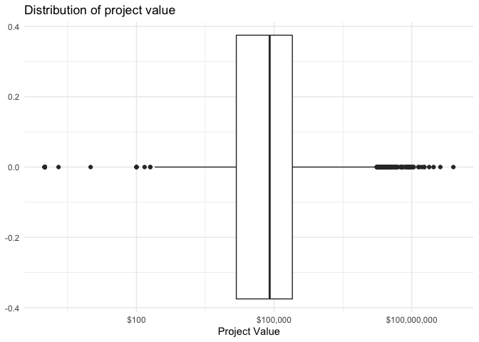<!-- -->

*Task 2* : Investigate how many NAs there are per variable.

``` r
how_many_NAs <- building_permits %>% summarise(across(everything(), ~sum(is.na(.))))

how_many_NAs %>% pivot_longer(cols=everything()) %>%
  ggplot(aes(x=name, y=value))+
  geom_col()+
  geom_text(aes(label=value), nudge_y = 1000)+
  theme_minimal()+
  theme(axis.text.x = element_text(angle = 90, vjust = 0.5, hjust=1))+
  xlab("Variable")+
  ylab("Number of missing entries")+
  ggtitle("Number of missing entries by column")
```

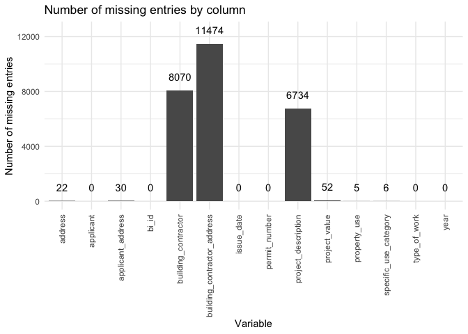<!-- -->

*Task 4* = Explore the relationship between 2 variables in a plot. I am
going to explore the relationship between permit type and project value.

``` r
building_permits %>%
  filter(project_value!=0) %>%
  ggplot(aes(x=type_of_work, y=project_value))+
  geom_boxplot()+
  scale_y_log10(labels = scales::dollar_format())+
  xlab("Reason for permit")+
  ylab("log10(Project Value)")+
  ggtitle("Project value by permit type")+
  coord_flip()
```

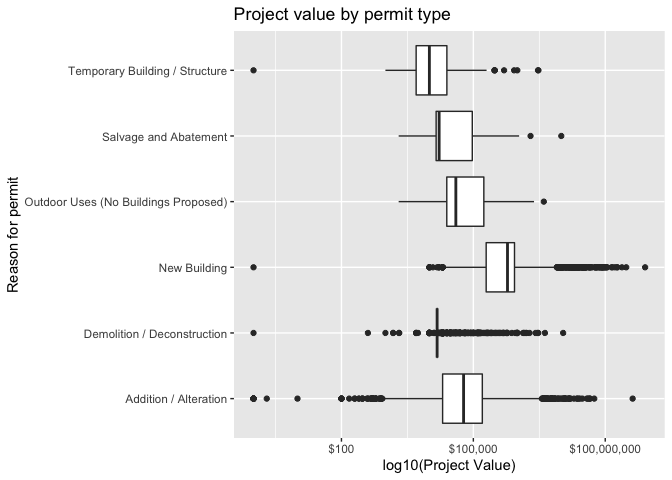<!-- -->

*Task 5* - Filter the dataset so that I am only looking at permits for
new buildings.

``` r
new_buildings <- building_permits %>% filter(type_of_work == "New Building")
```

<!----------------------------------------------------------------------------->

# Task 3: Write your research questions (5 points)

So far, you have chosen a dataset and gotten familiar with it through
exploring the data. Now it’s time to figure out 4 research questions
that you would like to answer with your data! Write the 4 questions and
any additional comments at the end of this deliverable. These questions
are not necessarily set in stone - TAs will review them and give you
feedback; therefore, you may choose to pursue them as they are for the
rest of the project, or make modifications!

<!--- *****START HERE***** --->

*Research Question 1* - How has the cost for new building projects
changed over time?

*Research Question 2* - How has the frequency of addition/change to
existing buildings changed over time?

*Research Question 3* - Has the number of single-family permits
decreased over time?

*Research Question 4* - Who are the applicants in each year with the
most projects in the following ranges: 0-1mil, 1mil-10mil, 10mil-20mil,
\>20mil?

# Task 4: Process and summarize your data (13 points)

From Task 2, you should have an idea of the basic structure of your
dataset (e.g. number of rows and columns, class types, etc.). Here, we
will start investigating your data more in-depth using various data
manipulation functions.

### 1.1 (10 points)

Now, for each of your four research questions, choose one task from
options 1-4 (summarizing), and one other task from 4-8 (graphing). You
should have 2 tasks done for each research question (8 total). Make sure
it makes sense to do them! (e.g. don’t use a numerical variables for a
task that needs a categorical variable.). Comment on why each task helps
(or doesn’t!) answer the corresponding research question.

Ensure that the output of each operation is printed!

**Summarizing:**

1.  Compute the *range*, *mean*, and *two other summary statistics* of
    **one numerical variable** across the groups of **one categorical
    variable** from your data.
2.  Compute the number of observations for at least one of your
    categorical variables. Do not use the function `table()`!
3.  Create a categorical variable with 3 or more groups from an existing
    numerical variable. You can use this new variable in the other
    tasks! *An example: age in years into “child, teen, adult, senior”.*
4.  Based on two categorical variables, calculate two summary statistics
    of your choosing.

**Graphing:**

5.  Create a graph out of summarized variables that has at least two
    geom layers.
6.  Create a graph of your choosing, make one of the axes logarithmic,
    and format the axes labels so that they are “pretty” or easier to
    read.
7.  Make a graph where it makes sense to customize the alpha
    transparency.
8.  Create 3 histograms out of summarized variables, with each histogram
    having different sized bins. Pick the “best” one and explain why it
    is the best.

Make sure it’s clear what research question you are doing each operation
for!

<!------------------------- Start your work below ----------------------------->

*Research Question 1* - How has the cost for new building projects
changed over time? Doing Task 1 - 6 - 7

``` r
#Step 1 - Histograms to plot the distribution of new building project costs in 2017/18/19/20 with different bin sizes
# This is helpful because it will show us if the distribution of new building project costs is different between the years (ie. my research question). 

building_permits %>% filter(project_value >0) %>%
  filter(type_of_work == "New Building") %>%
  ggplot(aes(x=project_value, fill=factor(year)))+
  geom_histogram(aes(y=..density..))+
  geom_density(alpha=0.2)+
  scale_x_log10(labels=scales::label_dollar(), breaks=c(0, 100, 1000, 10000, 100000, 1e6, 1e8, 1e10))+
  xlab("Values of new building projects")+
  scale_fill_npg(name="Year")+
  ggtitle("bin size = 30")+
  theme_minimal()
```

    ## `stat_bin()` using `bins = 30`. Pick better value with `binwidth`.

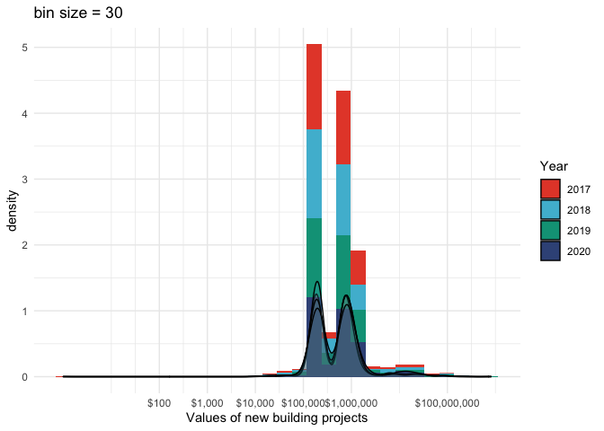<!-- -->

``` r
# Trying setting the bins to 50. This looks the best out of the three options I tested,
# the bins are big enough to still be interpretable (100 makes the bins really small, 30 too big)

building_permits %>% filter(project_value >0) %>%
  filter(type_of_work == "New Building") %>%
  ggplot(aes(x=project_value, fill=factor(year)))+
  geom_histogram(aes(y=..density..), bins=50)+
  geom_density(alpha=0.2)+
  scale_x_log10(labels=scales::label_dollar(), breaks=c(0, 100, 1000, 10000, 100000, 1e6, 1e8, 1e10))+
  xlab("Values of new building projects")+
  scale_fill_npg(name="Year")+
    ggtitle("bin size = 50")+
  theme_minimal()
```

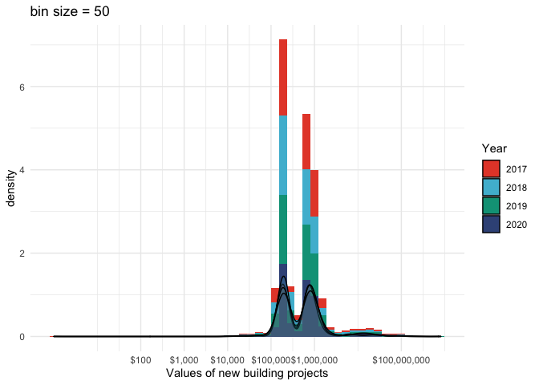<!-- -->

``` r
building_permits %>% filter(project_value >0) %>%
  filter(type_of_work == "New Building") %>%
  ggplot(aes(x=project_value, fill=factor(year)))+
  geom_histogram(aes(y=..density..), bins=100)+
  geom_density(alpha=0.2)+
  scale_x_log10(labels=scales::label_dollar(), breaks=c(0, 100, 1000, 10000, 100000, 1e6, 1e8, 1e10))+
  xlab("Values of new building projects")+
  scale_fill_npg(name="Year")+
    ggtitle("bin size = 100")+
  theme_minimal()
```

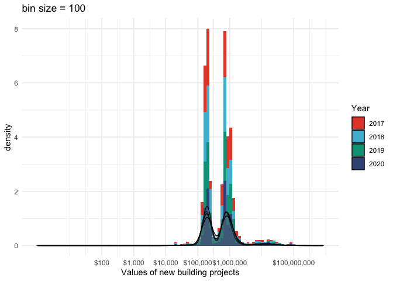<!-- -->

``` r
# Step 2: Calculating summary statistics of project value for each type of permit. Useful in comparing the average cost of a # new building project versus other types of projects. Not very useful in answering the reserch question.
building_permits %>% filter(project_value > 0) %>% 
                              group_by(type_of_work) %>% summarise(mean = mean(project_value, na.rm=TRUE),
                                                          min = min(project_value, na.rm=TRUE),
                                                          max = max(project_value, na.rm=TRUE),
                                                          sd = sd(project_value, na.rm=TRUE),
                                                          median = median(project_value, na.rm=TRUE))
```

    ## # A tibble: 6 × 6
    ##   type_of_work                             mean   min       max        sd median
    ##   <chr>                                   <dbl> <dbl>     <dbl>     <dbl>  <dbl>
    ## 1 Addition / Alteration                 303589.     1 420000000  4421293. 6   e4
    ## 2 Demolition / Deconstruction            40172.     1  11020000   272713. 1.5 e4
    ## 3 New Building                         2080237.     1 807185500 15944641. 5.98e5
    ## 4 Outdoor Uses (No Buildings Proposed)  381748.  2000   4004560   890930. 4   e4
    ## 5 Salvage and Abatement                 403619.  2000  10000000  1562880. 1.67e4
    ## 6 Temporary Building / Structure         69881.     1   3016114   302536. 1   e4

``` r
#Step 3 - plot project value versus year for new buildings. This is useful in answering the research question (it is the same data as the histograms, but as boxplots). 
building_permits %>% filter(project_value >0) %>%
  filter(type_of_work == "New Building") %>%
  ggplot(aes(x=factor(year), y=project_value))+
  scale_y_log10(labels = scales::dollar_format())+
  xlab("Year")+
  ylab("Values of new building projects")+
  theme_minimal()+
  geom_boxplot()+
  ggtitle("New building project costs by year", subtitle = "There doesn't seem to a significant difference between the years")
```

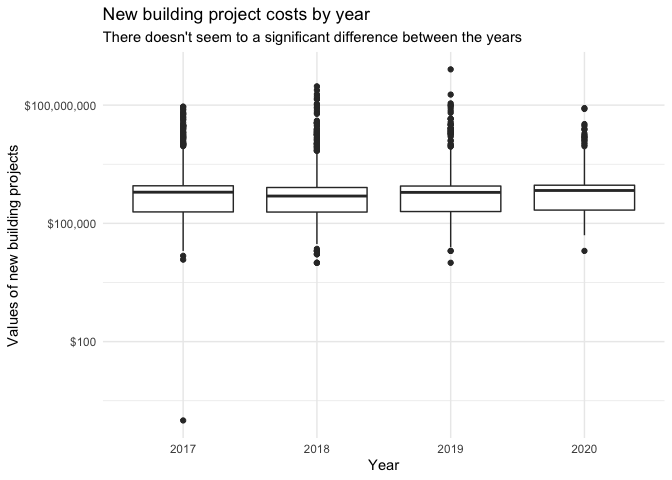<!-- -->

Based on these plots, there doesn’t seem to be a significant change in
project cost for new buildings between 2017-2020.

*Research Question 2* - How has the frequency of addition/change to
existing buildings changed over time?

``` r
# Step 1 - Quantify the number of observations of addition/change permits per year (Task 2). This is useful in answering the question, as it gives us exactly what we are looking for.

building_permits %>% filter(type_of_work == "Addition / Alteration") %>%
  group_by(year) %>%
  summarise("Number of addition/alteration permits" = n())
```

    ## # A tibble: 4 × 2
    ##    year `Number of addition/alteration permits`
    ##   <dbl>                                   <int>
    ## 1  2017                                    3133
    ## 2  2018                                    3321
    ## 3  2019                                    3042
    ## 4  2020                                     884

``` r
permits_by_year <- building_permits %>%
  group_by(year, type_of_work) %>%
  summarise("n_of_permits" = n())
```

    ## `summarise()` has grouped output by 'year'. You can override using the
    ## `.groups` argument.

``` r
#Step 2 - Make a barchart showing the differences in permit types across the three years (Task 5). Using the same summary data as Step 1, but showing patterns for all types of permits. This is a nice representation but harder to interpret thatn a scatterplot.

permits_by_year %>% ggplot(aes(x=factor(year), y=n_of_permits, fill=type_of_work))+
  geom_col(position=position_dodge())+
  geom_text(aes(label=n_of_permits, y=n_of_permits+100), position=position_dodge(width=1), size=3)+
  xlab("Year")+
  ylab("Number of permits")+
  ggsci::scale_fill_npg(name="Type of permit")+
  ggtitle("Number of different types of permits by year")+
  theme_minimal()
```

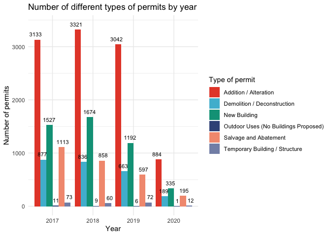<!-- -->

``` r
#Step 3 - Same information as in the plot before, but as a scatterplot. This is more visually appealing to see trends across the years. 

permits_by_year %>% ggplot(aes(x=factor(year), y=n_of_permits, color=type_of_work, group=type_of_work))+
  geom_point()+
  geom_line()+
  scale_colour_npg(name="Type of permit")+
  xlab("Year")+
  ylab("Number of permits")+
  ggtitle("Number of different permits by year")+
  theme_minimal()
```

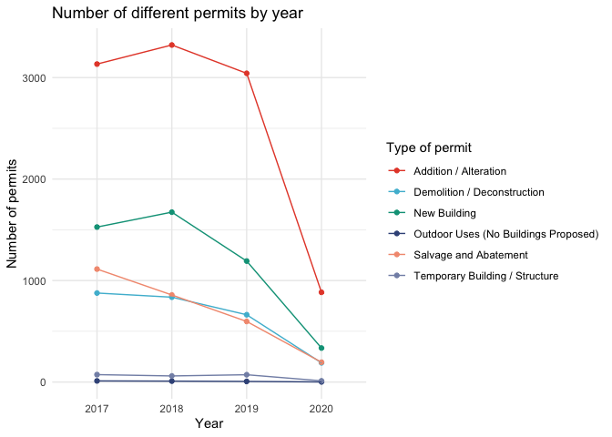<!-- -->

It looks like addition/alteration and new building permits peaked in
2018 and then decreased after that. Salvage and Abatement and Demolition
permits have been decreasing since 2017.

*Research Question 3* - Has the number of single-family permits
decreased over time? (Task 4 and Task 5)

``` r
# Calculating summary statistics using two categorical variables. The frequency calculated here is useful in answering the research question. 
new_one_family <- building_permits %>% filter(specific_use_category== "One-Family Dwelling", type_of_work=="New Building") %>%
  group_by(year) %>%
  summarise(mean_project_value = mean(project_value, na.rm=TRUE),
            max_project_value = max(project_value, na.rm=TRUE),
            frequency = n())

print(new_one_family)
```

    ## # A tibble: 4 × 4
    ##    year mean_project_value max_project_value frequency
    ##   <dbl>              <dbl>             <dbl>     <int>
    ## 1  2017            949481.           4500000       293
    ## 2  2018            920379.           6295000       271
    ## 3  2019           1022927.           8000000       186
    ## 4  2020            989036.           3125000        53

``` r
# Plotting the data as a scatterplot to show that new building permits intended for single-family use have been declining over the years. 
new_one_family %>% ggplot(aes(x=year, y=frequency))+
  geom_point()+
  geom_line()+
  xlab("Year")+
  ylab("Number of new one family dwelling permits")+
  ggtitle("New building permits for single-family use")+
  theme_minimal()
```

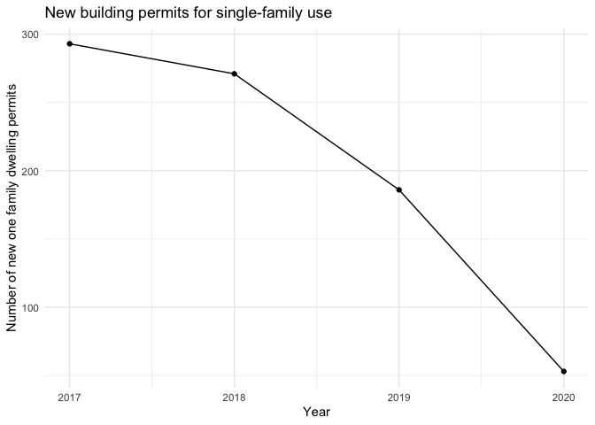<!-- -->

The number of permits for single-family new building has decreased
between 2017-2020.

*Research Question 4* - Who are the applicants with the most projects in
different cost brackets (Task 3)

``` r
# I am creating a new column that splits project value in four brackets (less than 1mil, 1mil-10mil, 10mil-20mil, and greater than 20mil). I can then find out which applicants have the most permits in each bracket.
project_value_cat <- building_permits %>% mutate(project_value_cat = case_when(project_value < 1e6 ~ "less_than_1mil",
                                                                               project_value > 1e6 & project_value <1e7  ~ "1mil - 10mil",
                                                                               project_value > 1e7 & project_value < 2e7 ~ "10mil - 20mil",
                                                                               project_value > 2e7 ~ ">20mil"))

top_applicants <- project_value_cat %>% filter(project_value != 0 & !is.na(project_value_cat)) %>%
  group_by(applicant, project_value_cat) %>%
  summarise(n_of_permits= n()) %>%
  group_by(project_value_cat) %>%
  slice_max(order_by=n_of_permits)
```

    ## `summarise()` has grouped output by 'applicant'. You can override using the
    ## `.groups` argument.

``` r
project_value_cat %>% filter(project_value != 0 & !is.na(project_value_cat)) %>%
  group_by(applicant, project_value_cat) %>%
  summarise(n_of_permits= n()) %>%
  group_by(project_value_cat) %>%
  ggplot(aes(x=project_value_cat, y=n_of_permits))+
  geom_jitter(height=0, alpha=0.5)+
  geom_point(data=top_applicants, aes(color=applicant), size=5)+
  scale_color_npg(name="Applicants with most permits")+
  xlab("Project value bin")+
  ylab("Number of permits")+
  ggtitle("Number of permits per applicant by project value")+
  theme_minimal()
```

    ## `summarise()` has grouped output by 'applicant'. You can override using the
    ## `.groups` argument.

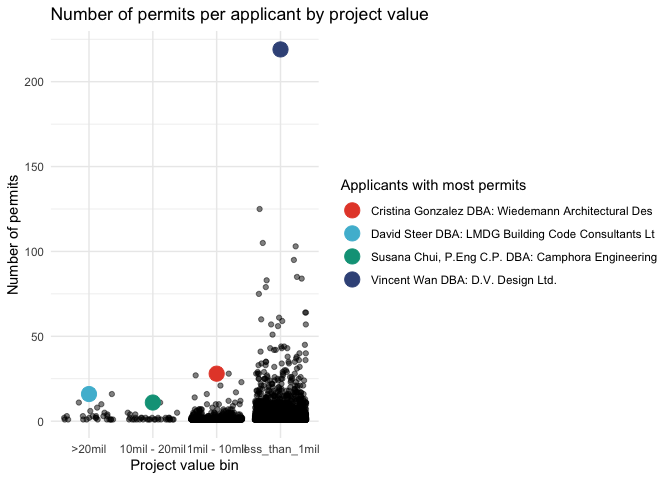<!-- -->

<!----------------------------------------------------------------------------->

### 1.2 (3 points)

Based on the operations that you’ve completed, how much closer are you
to answering your research questions? Think about what aspects of your
research questions remain unclear. Can your research questions be
refined, now that you’ve investigated your data a bit more? Which
research questions are yielding interesting results?

<!-------------------------- Start your work below ---------------------------->

I think I was able to answer all of my research question. The most
interesting result was the declining number of permits for new buildings
for single-family use. It would be interesting to see how this compares
to new-building permits for other uses. I would also really like to be
able to make a map of number of permits by neighborhood since we have
the postal codes, but that is beyond my coding abilities at the moment.

<!----------------------------------------------------------------------------->

### Attribution

Thanks to Icíar Fernández Boyano for mostly putting this together, and
Vincenzo Coia for launching.
